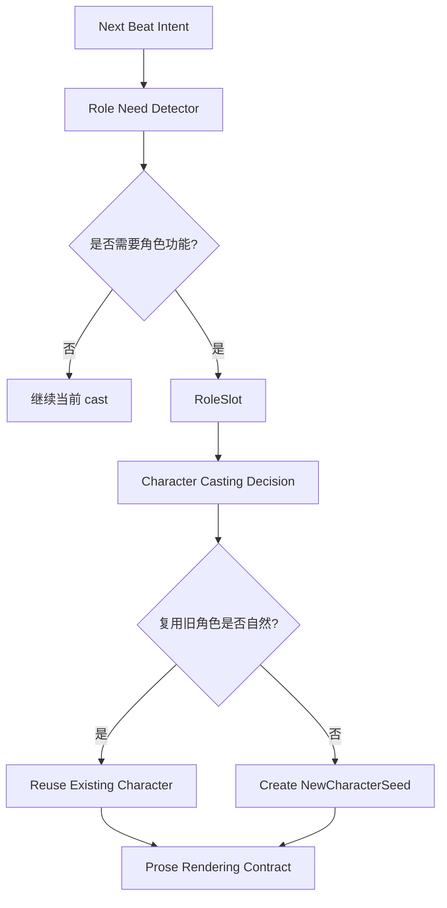
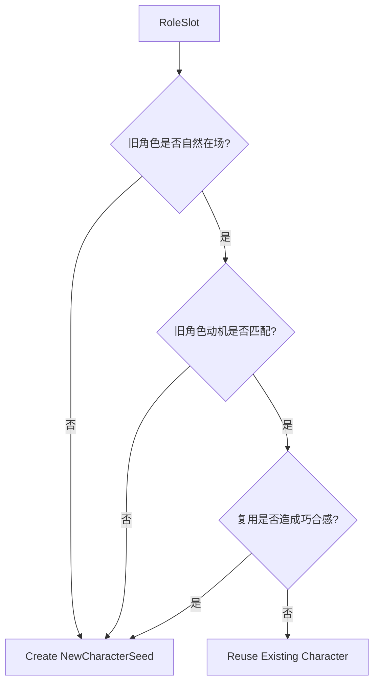

# 28. Role Need 与 Cast Expansion

> 本文档定义 Sextant 如何判断当前场景是否需要新角色，以及如何避免 Agent 过度复用已有角色。这里不讨论实现方式，只讨论叙事功能、cast 决策和草稿层风险。

## 1. 问题

逐页推进时，Agent 很容易复用 Memory 中已有角色。这样做看似安全，但会导致：

- 世界变小；
- 所有线索、阻碍、转折都来自同一批人；
- 已有角色承担过多叙事功能；
- 场景出现巧合感；
- 本该自然出现的局部人物被旧角色替代。

因此需要一个显式的 **Role Need Detector**。

## 2. 核心原则

```text
不要先问“用哪个角色”。
先问“当前场景需要什么叙事功能”。
```

也就是说：



## 3. RoleSlot

RoleSlot 表示当前场景需要一个角色承担某种叙事功能。

| 字段 | 说明 |
|---|---|
| role_slot_id | 角色功能槽 ID |
| function | witness / gatekeeper / messenger / pressure_source / local_color 等 |
| scene_need | 为什么当前场景需要这个功能 |
| required_traits | 角色需要具备的局部特征 |
| required_knowledge | 角色必须知道或不知道什么 |
| risk_level | low / medium / high |
| can_use_existing_character | 是否可以由已有角色承担 |
| reason_not_existing | 如果不适合复用旧角色，原因是什么 |

## 4. 常见角色功能

| function | 说明 | 常见例子 |
|---|---|---|
| witness | 目击者 | 看见关键动作、听到传闻 |
| gatekeeper | 阻拦者 | 门卫、秘书、守卫、店员 |
| messenger | 传递信息的人 | 信使、电话另一端、路人通知者 |
| pressure_source | 施压者 | 上司、债主、警察、老师 |
| contrast_character | 映照主角的人 | 天真孩子、失败前辈、冷漠路人 |
| clue_holder | 持有线索的人 | 医生、档案管理员、旅店老板 |
| local_color | 增加世界质感的人 | 摊贩、司机、邻居、学生 |
| antagonist_proxy | 反派代理 | 打手、律师、眼线、下属 |
| emotional_mirror | 映照情绪的人 | 让主角看见自己问题的人 |
| complication | 制造小麻烦的人 | 误会者、打断者、临时阻碍 |

## 5. Reuse vs Create 决策



| 判断问题 | 倾向复用旧角色 | 倾向创建新角色 |
|---|---|---|
| 该功能是否和旧角色已有欲望强相关 | 是 | 否 |
| 旧角色出现在这里是否自然 | 是 | 否 |
| 复用是否需要解释“他怎么刚好在这里” | 否 | 是 |
| 该功能是否只是一次性场景功能 | 否 | 是 |
| 新角色是否能增加世界广度 | 否 | 是 |
| 新角色是否会稀释当前冲突 | 是 | 否 |
| 新角色是否会引入重大设定负担 | 是 | 否 |

## 6. 允许自动创建新角色的场景

以下情况可以默认允许创建低风险新角色：

- witness；
- gatekeeper；
- messenger；
- local_color；
- minor pressure source；
- scene-local complication；
- 一次性服务场景质感的人物。

示例：

```text
当前场景需要有人阻止主角进入档案室。
复用旧角色会显得刻意。
创建一个 scene-local gatekeeper 更自然。
```

## 7. 不应创建新角色的场景

以下情况不应随便创建新角色：

- 新角色会掌握重大秘密；
- 新角色会改变主线关系；
- 新角色会成为长期反派或主要盟友；
- 只是为了逃避已有角色之间的冲突；
- 已有角色更适合承担这个压力；
- 新角色会让当前场景焦点分散。

## 8. Cast Reuse Risk

过度复用旧角色应成为草稿层风险。

| risk_type | 含义 | 是否进入正式 ReviewItem |
|---|---|---:|
| cast_reuse_risk | 为了安全而过度复用已有角色，导致巧合或世界变小 | 否，通常是 draft-local finding |
| cast_creation_risk | 新角色承担了过重 canon 功能 | 否，除非接受后造成 Memory 冲突 |

AgentReviewFinding 示例：

```text
cast_reuse_risk:
Kestrel 已经连续承担线索持有者、阻拦者、情绪镜像三种功能。
当前 gatekeeper 功能更适合由新的 scene-local 角色承担。
```

## 9. 输出

Role Need 与 Cast Expansion 输出：

| 输出 | 说明 |
|---|---|
| RoleSlot | 当前场景需要的角色功能 |
| CharacterCastingDecision | reuse_existing / create_new / avoid_character |
| NewCharacterSeed | 如果创建新角色，提供最小种子 |
| cast_rationale | 为什么复用或创建 |
| cast_risk | 可能的草稿风险 |

## 10. 结论

Cast Expansion 的目标不是鼓励乱造角色，而是避免 Memory salience 让 Agent 过度保守。

```text
低风险场景功能可以创建新角色；
长期重要角色必须经过作者接受和 Memory 回写。
```