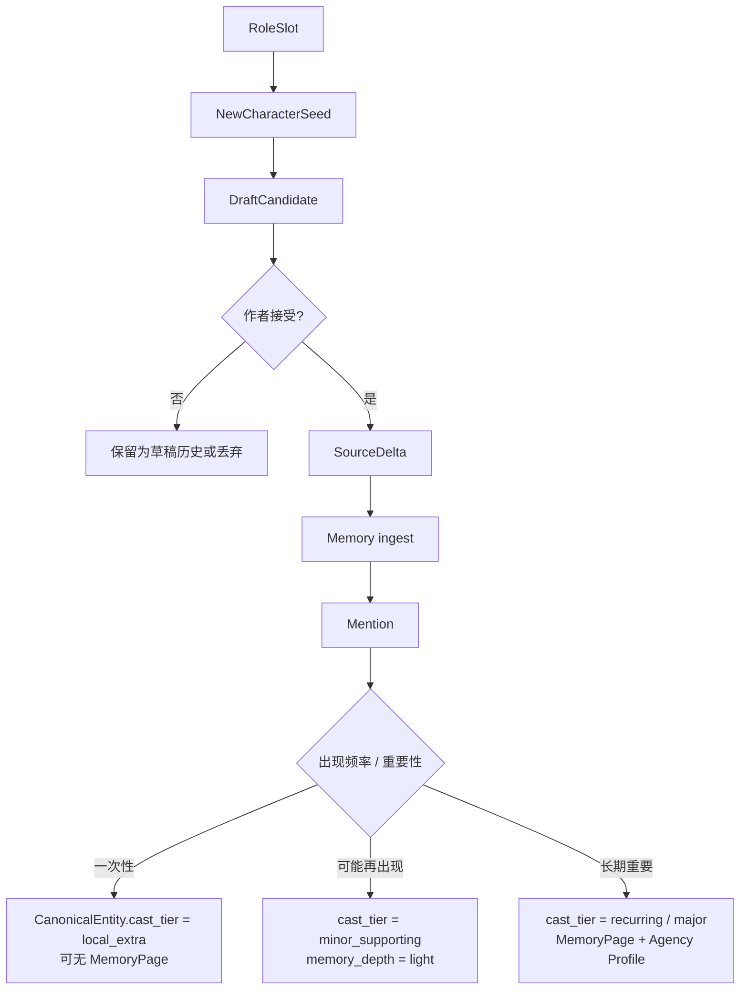
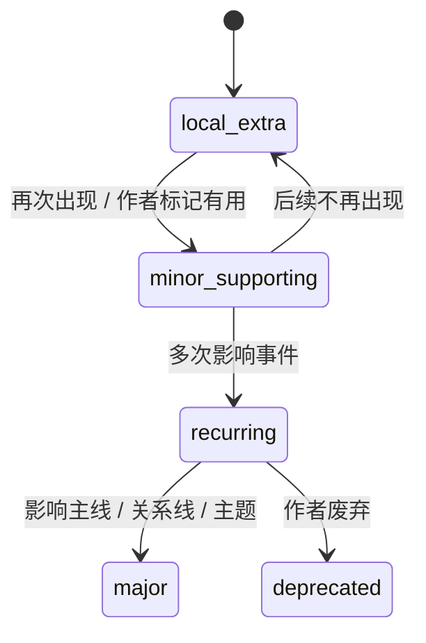

# 29. 新角色创建策略

> 本文档定义 Sextant 写作 Agent 在逐页推进时如何创建新角色。这里不讨论实现方式，只讨论角色分级、记忆升格、作者主权和风险边界。

## 1. 核心问题

逐页写作 Agent 容易把所有叙事功能交给已有角色，因为已有角色在 Memory 中更显眼，也更安全。但小说世界需要适度扩展 cast：不是所有阻拦、线索、压力、对照、世界质感都应该由主角团承担。

新角色创建策略的目标是：

```text
允许低风险新角色自然进入场景，
同时防止 Agent 随意创造长期重要角色或污染 canon。
```

## 2. 新角色分级

新角色分级映射到 Memory 模型中的 `CanonicalEntity.cast_tier`，不是 `canonical_status`。

| 等级 | cast_tier | 说明 | Memory 处理 | 是否需要作者确认 |
|---|---|---|---|---:|
| Local Extra | local_extra | 一次性场景人物 | 可只保留 SourceSpan / Mention，不建完整 MemoryPage | 否 |
| Minor Supporting Character | minor_supporting | 可能再次出现的小配角 | 可轻量 MemoryPage，状态 provisional | 不强制 |
| Recurring Character | recurring | 多次出现并影响局部情节 | Character MemoryPage + 简版 Agency Profile | 建议提示 |
| Major Character | major | 影响主线、关系线、主题或长期冲突 | 完整 Character MemoryPage + Agency Profile | 是 |

`cast_tier` 表示角色在 cast 中的叙事重要性；`canonical_status` 表示该实体是否 canon / draft / provisional / discarded / contradicted。二者不能混用。

## 3. NewCharacterSeed

NewCharacterSeed 是草稿层对象，不是正式 Character MemoryPage。它只用于 DraftCandidate。

| 字段 | 说明 |
|---|---|
| seed_id | 新角色种子 ID |
| role_function | witness / gatekeeper / messenger / local_color 等 |
| display_hint | 临时称呼或名字 |
| scope | scene_local / chapter_local / recurring_candidate / major_candidate |
| traits | 少量可写入场景的特征 |
| voice_hint | 说话方式或动作特征 |
| knowledge_boundary | 他知道什么 / 不知道什么 |
| narrative_purpose | 为什么当前场景需要他 |
| promotion_hint | 是否可能升格为 recurring character |
| risk | 是否有引入复杂 canon 的风险 |

示例：

```text
NewCharacterSeed:
  display_hint: 老赵
  role_function: gatekeeper
  scope: scene_local
  traits:
    - suspicious
    - practical
  voice_hint:
    - short replies
    - avoids eye contact
  knowledge_boundary:
    - knows archive door was opened last night
    - does not know who stole the map
```

## 4. 新角色进入 Memory 的路径



关键：Agent 不能直接创建正式角色页。只有作者接受了包含该角色的正文后，Memory 才根据证据决定如何记录。

## 5. Memory 落点

| cast_tier | CanonicalEntity | MemoryPage | memory_depth | Agency Profile |
|---|---|---|---|---|
| local_extra | 可选；也可只保留 Mention | 通常不建 | none / light | 无 |
| minor_supporting | 是，canonical_status 通常为 provisional 或 canon | 可选轻量页 | light | 无或极简 |
| recurring | 是 | 是 | standard | 简版 |
| major | 是 | 是 | full | 完整 |

如果实现选择为 local_extra 创建 CanonicalEntity，应仍设置 `cast_tier = local_extra`，避免它被 ContextPack 当成重要角色反复召回。

## 6. 自动允许创建的角色

以下角色通常可以由 Agent 创建为 Local Extra 或 Minor Supporting Character：

- 门卫、店员、司机、邻居、路人；
- 小型 witness；
- 传话者；
- 只承担局部阻碍的人；
- 增加场景质感的人；
- 不掌握重大秘密的人；
- 不改变长期关系线的人。

## 7. 需要提示作者的角色

以下角色不应静默创建为长期 canon：

- 新的长期盟友；
- 新的长期反派；
- 新的亲属关系；
- 掌握核心秘密的人；
- 能改变主线方向的人；
- 与主角产生重大情感关系的人；
- 引入新阵营、新世界规则、新历史的人。

这些可以作为 DraftCandidate 里的 proposed major character 出现，但必须显式提示作者。

## 8. 升格规则

新角色不是一次性决定重要性，而是可以随文本证据升格。



升格条件：

| 升格目标 | 条件 |
|---|---|
| local_extra -> minor_supporting | 再次出现，或产生可引用事实 |
| minor_supporting -> recurring | 多次参与事件，或与主角有持续关系 |
| recurring -> major | 影响主线、主题、长期关系、核心秘密 |

## 9. 降低复杂度的策略

为了避免 cast 膨胀：

- Local Extra 不需要完整角色页；
- 低风险新角色可以只保存 mention 和 appearance；
- 名字可以推迟确定；
- 一次性角色可以使用功能性称呼；
- 只有重复出现或作者标记重要时，才生成 MemoryPage；
- 新角色不能默认拥有复杂背景；
- ContextPack 应根据 `cast_tier` 和 `memory_depth` 控制召回强度。

## 10. AgentReviewFinding

新角色相关风险属于草稿层风险。所有 risk_type 以 [26-agent-review-policy.md](26-agent-review-policy.md) 第 4 节为唯一 source-of-truth。

常见相关风险：

| risk_type | 说明 |
|---|---|
| cast_creation_risk | 新角色过重、过多或引入复杂 canon |
| cast_reuse_risk | 应该创建新角色却强行复用旧角色 |
| cast_focus_risk | 新角色抢走当前场景焦点 |
| cast_complexity_risk | cast 扩展太快，读者负担上升 |

这些风险只有在作者接受文本并进入 Memory 后，才可能由 Conflict Policy Gate 转成正式 ReviewItem。

## 11. 结论

新角色创建策略的核心是分级：

```text
Local Extra 可以轻量产生；
Recurring Character 需要记忆升格；
Major Character 需要作者主权。
```

这让 Agent 不再被已有 cast 锁死，同时也不会随意污染长期 canon。