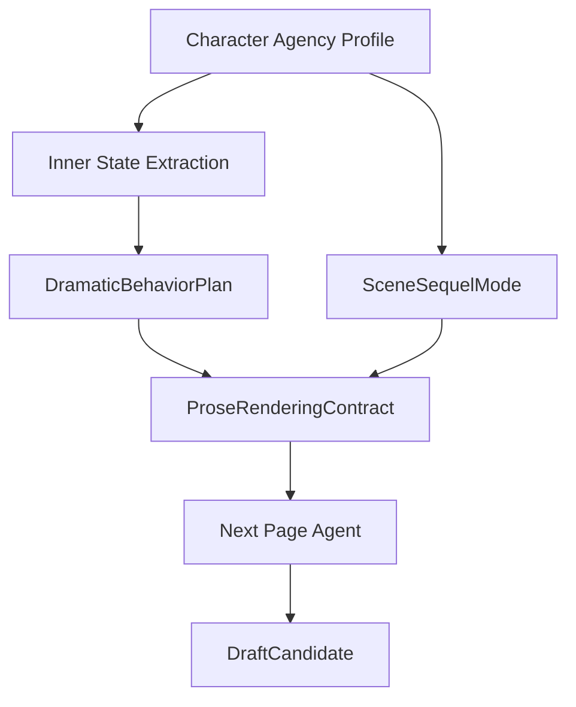

# 30. Dramatization Layer

> 本文档定义 Sextant 如何把角色内心、动机、秘密和压力转成可写进场景的戏剧化行为。这里不讨论实现方式，只讨论数据流、约束和输出结构。

## 1. 问题

如果把角色内心直接喂给最终写作模型，模型很容易写成流水账：

```text
她很害怕。
她开始怀疑他。
她不知道该怎么办。
她意识到自己不能退缩。
```

这些内容可能是正确的角色状态，但不是故事。故事需要行动、选择、阻力、潜台词、物体、节奏和转折。

## 2. 定位

Dramatization Layer 位于 Character Agency Pass 和 ProseRenderingContract 之间。它和 SceneSequelMode 是并行的控制产物，最终由 ProseRenderingContract 汇总。



它的职责是把“角色正在想什么”转成“读者可以看见、听见、感受到什么”。

## 3. 核心原则

```text
Inner state is material, not prose.
```

中文：

```text
内心状态是素材，不是正文。
```

内心状态必须先经过戏剧化转译。

## 4. DramaticBehaviorPlan

DramaticBehaviorPlan 是写正文前的中间产物。

| 字段 | 说明 |
|---|---|
| inner_state | 角色内心状态 |
| render_as_action | 用什么动作表现 |
| render_as_dialogue | 用什么台词或潜台词表现 |
| render_as_silence | 哪些沉默、停顿、回避可以表现 |
| render_as_object | 哪个物体或环境细节承载情绪 |
| render_as_choice | 角色做出什么选择 |
| avoid_direct_telling | 哪些句子不应直接写 |
| turn | 本段应产生的微转折 |

示例：

```text
inner_state:
  Mira 害怕自己依赖 Orrin。

render_as_action:
  - 她避开 Orrin 伸来的手。
  - 她把空地图盒推到桌边，却不看他。

render_as_dialogue:
  - “我一个人去。”

render_as_object:
  - 盒盖裂缝、手指按住木纹。

avoid_direct_telling:
  - “Mira 害怕自己依赖 Orrin。”
```

## 5. 常见内心状态转译

| 内心状态 | 不要直接写 | 可转成 |
|---|---|---|
| 恐惧 | 她很害怕 | 迟疑、回避、过度控制、抓住物体 |
| 怀疑 | 她开始怀疑他 | 试探性问题、观察反应、故意说错信息 |
| 羞耻 | 他感到羞耻 | 转移话题、压低声音、攻击别人 |
| 爱意 | 他爱她 | 保护、记住细节、让步、沉默 |
| 愤怒 | 她很愤怒 | 动作变硬、句子变短、升级冲突 |
| 不信任 | 他不信任她 | 不交出物品、不透露地点、保留后手 |
| 悲伤 | 他很悲伤 | 停顿、触碰旧物、避开某个词 |
| 想独立 | 她想证明自己 | 拒绝帮助、主动承担风险 |

## 6. 直接内心说明预算

Dramatization Layer 不是禁止所有内心句，而是限制其数量和位置。预算由 ProseRenderingContract 最终确定。

| 模式 | 直接内心说明预算 |
|---|---|
| action-heavy scene | 0-1 句短内心，且不超过段落体量约 5% |
| dialogue conflict | 1-2 句短内心，用于潜台词补强 |
| sequel / reaction | 可以多一些，但必须服务 dilemma -> decision，不超过约 10% |
| exposition bridge | 可以适度 telling，但不能替代关键戏剧时刻 |

建议规则：

```text
短 passage 优先使用绝对上限；
长 passage 同时使用比例上限；
其余内心状态必须通过动作、选择、对话、感官和物体表现。
```

## 7. Non-POV 角色规则

非 POV 角色的内心不能直接写。

| 角色类型 | 可写 | 不可写 |
|---|---|---|
| POV 角色 | 内心、误解、感官、行动 | 仍需控制直接说明预算 |
| 非 POV 角色 | 动作、台词、表情、沉默、矛盾行为 | 直接内心解释 |
| 不在场角色 | 被提及、被回忆、留下痕迹 | 直接影响当前场景 |

## 8. Dramatization risks

如果候选文本没有把内心状态戏剧化，应产生草稿层 AgentReviewFinding。所有 risk_type 以 [26-agent-review-policy.md](26-agent-review-policy.md) 第 4 节为唯一 source-of-truth。

常见相关风险：

| risk_type | 说明 |
|---|---|
| exposition_risk | 直接解释太多，缺少场景行为 |
| dramatization_risk | 没有动作、选择、对话或 turn |
| non_pov_mind_reading | 写了非 POV 角色内心 |
| inner_state_overload | 一段里塞入太多心理状态 |
| telling_over_action | 应该行动表现，却写成解释 |

这些风险默认是 AgentReviewFinding，不是正式 Memory ReviewItem。

## 9. 与 ProseRenderingContract 的关系

Dramatization Layer 产出 DramaticBehaviorPlan；SceneSequelMode 产出段落模式；ProseRenderingContract 汇总二者并规定最终 prose 如何使用它们。


## 10. 结论

Dramatization Layer 解决的是：

```text
角色状态正确，但故事不好看。
```

它让 Agent 不只是“知道角色想什么”，而是能够把角色内心转成读者能体验的故事行为。
