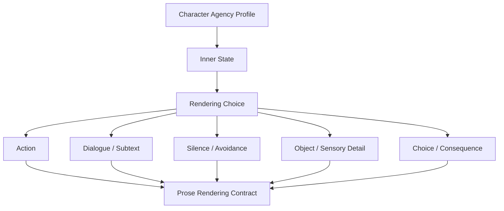

# 31. Inner State Rendering

> 本文档定义如何把角色的内心状态转译成可观察、可感知、可行动的场景表现。这里不讨论技术实现，只讨论写作控制原则和中间表示。

## 1. 核心问题

Character Agency Profile 会保存角色的欲望、恐惧、秘密、边界和误解。但这些信息不能直接原样写进正文。

错误方向：

```text
Mira 很害怕自己依赖 Orrin。她想证明自己独立。她开始怀疑 Kestrel。
```

更好的方向：

```text
Orrin 伸手时，她退了半步。
“我一个人去。”她说。
她把空地图盒推到 Kestrel 面前，故意报了一个错误的仓库名。
```

## 2. Inner State Rendering 的位置



Inner State Rendering 不生成最终正文，只生成“表现方式”。

## 3. 输入

| 输入 | 来源 | 用途 |
|---|---|---|
| inner_state | Character Agency Profile | 角色当前真实心理状态 |
| current_pressure | Scene / Event | 当前场景压力 |
| pov_constraint | Writing Context Pack | 是否允许直接进入内心 |
| relationship_stance | Character Memory | 对其他角色的态度 |
| object_state | Memory | 可承载情绪的物品 |
| style_memory | Writing Context Pack | 当前作品的表达习惯 |

## 4. 输出

| 输出 | 说明 |
|---|---|
| render_channel | action / dialogue / silence / object / sensory / choice / thought |
| visible_behavior | 可观察行为 |
| subtext | 台词背后的未说出口的含义 |
| object_focus | 用哪个物体承载情绪 |
| sensory_focus | 用哪个感官细节呈现状态 |
| direct_thought_allowed | 是否允许直接写内心 |
| direct_thought_budget | 允许多少直接内心说明 |
| avoid_phrases | 禁止直说的心理总结 |

## 5. 渲染通道

| 通道 | 适合表现 | 示例 |
|---|---|---|
| action | 恐惧、拒绝、欲望、控制 | 后退、握紧、避开、递出、藏起 |
| dialogue | 试探、否认、攻击、防御 | 故意问错、简短回答、转移话题 |
| silence | 隐瞒、震惊、羞耻、压抑 | 停顿、不开口、换动作 |
| object | 依恋、记忆、焦虑、失控 | 地图盒、旧剑、杯沿、门锁 |
| sensory | 紧张、危险、孤独、压迫 | 声音变小、空气发冷、手心汗 |
| choice | 人物核心行为 | 拒绝帮助、承担风险、隐瞒线索 |
| thought | 必要内心说明 | 只在 POV 允许且预算允许时使用 |

## 6. 内心状态转译表

| 内心状态 | 低质量直写 | 推荐转译 |
|---|---|---|
| 害怕 | 她很害怕 | 动作迟疑、抓住物体、过度控制 |
| 怀疑 | 她开始怀疑他 | 试探性问题、观察反应、故意给假信息 |
| 羞耻 | 他觉得羞耻 | 转移话题、反击、低头、回避关键字 |
| 爱意 | 他爱她 | 记住细节、让步、保护、沉默 |
| 愤怒 | 她很生气 | 句子变短、动作变硬、选择升级冲突 |
| 不信任 | 他不信任她 | 保留信息、不交出物品、留后手 |
| 悲伤 | 他很悲伤 | 触碰旧物、避开名字、停顿 |
| 嫉妒 | 她嫉妒 | 讽刺、比较、注意对方小动作 |
| 想独立 | 她想证明自己 | 拒绝帮助、主动承担风险 |
| 内疚 | 他感到内疚 | 过度补偿、避免看对方、抢着承担 |

## 7. POV 约束

POV 决定 inner state 是否可以直接进入正文。

| 情况 | 处理 |
|---|---|
| POV 角色内心 | 可以少量直接写，但优先戏剧化 |
| 非 POV 角色内心 | 不能直接写，只能通过动作、台词、沉默表现 |
| 全知视角 | 可直接写更多内心，但仍需控制信息密度 |
| 不可靠叙述者 | 可让内心表达与行为矛盾，但必须标记 intent |

## 8. 直接内心说明预算

Inner State Rendering 应给最终 prose 一个预算。

| 场景类型 | 建议预算 |
|---|---|
| 高动作冲突 | 0-1 句短内心 |
| 对话冲突 | 1-2 句短内心，用于潜台词补强 |
| 反应 / 消化场景 | 可以稍多，但必须走 dilemma -> decision |
| 过渡摘要 | 可以 telling，但不能替代关键场景 |

预算不是机械字数，而是提醒模型：重要情绪优先通过戏剧动作呈现。

## 9. 输出示例

```text
inner_state:
  Mira 怀疑 Kestrel，但不想暴露自己已经发现地图线索。

render_channel:
  dialogue + object + action

visible_behavior:
  - 把空地图盒推到 Kestrel 面前
  - 故意报错仓库名
  - 不看 Orrin

subtext:
  她在试探 Kestrel 是否知道真实地点。

avoid_phrases:
  - “Mira 开始怀疑 Kestrel。”
  - “她不想暴露自己的怀疑。”
```

## 10. AgentReviewFinding

如果最终 DraftCandidate 违反 Inner State Rendering，可产生草稿层风险。

| risk_type | 说明 |
|---|---|
| inner_state_overload | 直接内心说明太多 |
| telling_over_action | 应该行动表现，却写成解释 |
| non_pov_mind_reading | 直接写了非 POV 角色心理 |
| subtext_missing | 台词没有潜台词，只是说明信息 |
| choice_missing | 角色没有做选择，只是在想 |

这些风险默认停留在 DraftCandidate 层，不是正式 ReviewItem。

## 11. 结论

Inner State Rendering 的目标是：

```text
让 Agent 知道角色内心，
但让正文呈现角色行动。
```

角色内心是写作素材；故事段落应该让读者通过行为、对话、沉默、物体和选择体验它。
