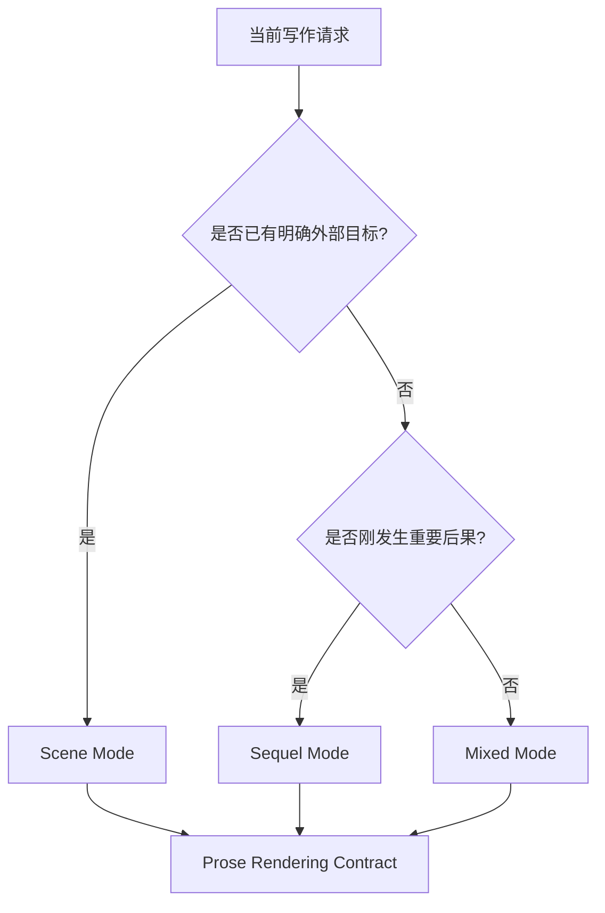

# 32. Scene / Sequel Mode

> 本文档定义 Sextant 写作 Agent 如何在逐页推进中判断当前段落是行动场景、反应场景，还是混合段落。这里不讨论实现方式，只讨论叙事模式和写作控制。

## 1. 为什么需要 Scene / Sequel Mode

如果 Agent 不区分段落模式，就容易把动作、解释、内心、设定、回忆混在一起，导致：

- 动作段落被内心说明拖慢；
- 反应段落没有 dilemma 和 decision；
- 角色想法很多，但故事没有推进；
- prose 没有 turn；
- 一段文字只是信息说明，不是故事。

Scene / Sequel Mode 的目标是让 Agent 明确：

```text
当前这段文字到底是在推进冲突，还是在消化后果。
```

## 2. 三种模式

| 模式 | 结构 | 适合用途 |
|---|---|---|
| scene | goal -> conflict -> setback / turn | 行动、对抗、试探、推进剧情 |
| sequel | reaction -> dilemma -> decision | 消化后果、整理情绪、形成下一步目标 |
| mixed | 小动作 + 小反应 + 小决定 | 逐页推进中的过渡段 |

## 3. Scene Mode

Scene Mode 是行动型段落。它要求角色带着目标进入阻力。


### Scene Mode 字段

| 字段 | 说明 |
|---|---|
| scene_goal | POV 或驱动角色当前想达成什么 |
| opposition | 阻力来自谁、什么环境、什么信息限制 |
| tactic | 角色采取什么策略 |
| escalation | 冲突如何升级 |
| turn | 本段发生什么小转折 |
| setback | 目标是否受阻，或者得到代价 |

### Scene Mode 对内心戏的限制

| 内容 | 处理 |
|---|---|
| 直接内心说明 | 很少，只允许短句 |
| 情绪 | 通过动作、台词、节奏表现 |
| 非 POV 角色心理 | 不直接写 |
| 设定解释 | 除非影响当前冲突，否则压缩或移除 |

## 4. Sequel Mode

Sequel Mode 是反应型段落。它不只是“想一想”，而是从事件后果中产生下一步决定。


### Sequel Mode 字段

| 字段 | 说明 |
|---|---|
| reaction | 角色对刚发生事件的情绪和身体反应 |
| dilemma | 角色面临什么选择或困境 |
| evaluation | 每个选择的代价 |
| decision | 角色决定下一步做什么 |
| new_goal | 决定带来的下一场景目标 |

### Sequel Mode 对内心戏的允许

Sequel Mode 可以容纳更多内心，但必须服务 dilemma -> decision。

| 好的反应段 | 坏的反应段 |
|---|---|
| 内心推动选择 | 内心反复解释同一情绪 |
| 情绪导致行动 | 情绪只是被描述 |
| 最后形成决定 | 最后仍停在感受 |
| 产生下一步目标 | 没有故事推进 |

## 5. Mixed Mode

逐页推进中，很多段落不是纯 scene 或纯 sequel。Mixed Mode 用于小步过渡。

```text
小行动
  ↓
短反应
  ↓
小选择
  ↓
进入下一步
```

Mixed Mode 适合：

- 场景内部过渡；
- 对话中的短暂停顿；
- 角色意识到某个小问题；
- 从动作转入下一轮行动；
- 一页末尾的微 hook。

## 6. Mode 决策



| 判断问题 | 倾向 Scene | 倾向 Sequel | 倾向 Mixed |
|---|---|---|---|
| 角色是否正在试图达成具体目标 | 是 | 否 | 可能 |
| 是否有明确阻力 | 是 | 否 | 轻微 |
| 是否刚经历后果 | 可能 | 是 | 可能 |
| 当前重点是否是选择 | 可能 | 是 | 是，小选择 |
| 是否需要快速进入下一动作 | 是 | 否 | 是 |

## 7. 与 Character Agency 的关系

Character Agency Pass 给出角色动机；Scene / Sequel Mode 决定这些动机如何进入段落。

| Agency 信息 | Scene Mode 用法 | Sequel Mode 用法 |
|---|---|---|
| immediate_want | 作为 scene_goal | 作为新目标候选 |
| fear | 通过行动回避表现 | 作为 reaction / dilemma |
| moral_boundary | 制造 conflict | 制造 dilemma |
| secret | 通过隐瞒和潜台词表现 | 作为选择代价 |
| relationship_stance | 影响策略 | 影响评估和决定 |

## 8. 输出给 Prose Rendering Contract

Scene / Sequel Mode 会输出：

| 字段 | 说明 |
|---|---|
| passage_mode | scene / sequel / mixed |
| required_goal | 本段必须服务的目标 |
| required_opposition | 本段必须出现的阻力 |
| required_turn | 本段必须有的小转折 |
| inner_state_budget | 直接内心说明预算 |
| ending_shape | setback / decision / hook / transition |

## 9. AgentReviewFinding

如果 DraftCandidate 没有满足当前 mode，可产生草稿层风险。

| risk_type | 说明 |
|---|---|
| scene_mode_risk | action scene 缺少 goal / opposition / turn |
| sequel_mode_risk | reaction scene 缺少 dilemma / decision |
| mode_mixing_risk | 动作和内心说明混乱，节奏不清 |
| no_turn_risk | 段落没有任何变化或推进 |

这些风险默认是 draft-local，不是正式 Memory ReviewItem。

## 10. 结论

Scene / Sequel Mode 的作用是让逐页写作有段落级结构。

```text
Scene 负责推进冲突。
Sequel 负责消化后果并形成决定。
Mixed 负责小步过渡。
```

它防止 Agent 把角色内心和设定说明堆成流水账。