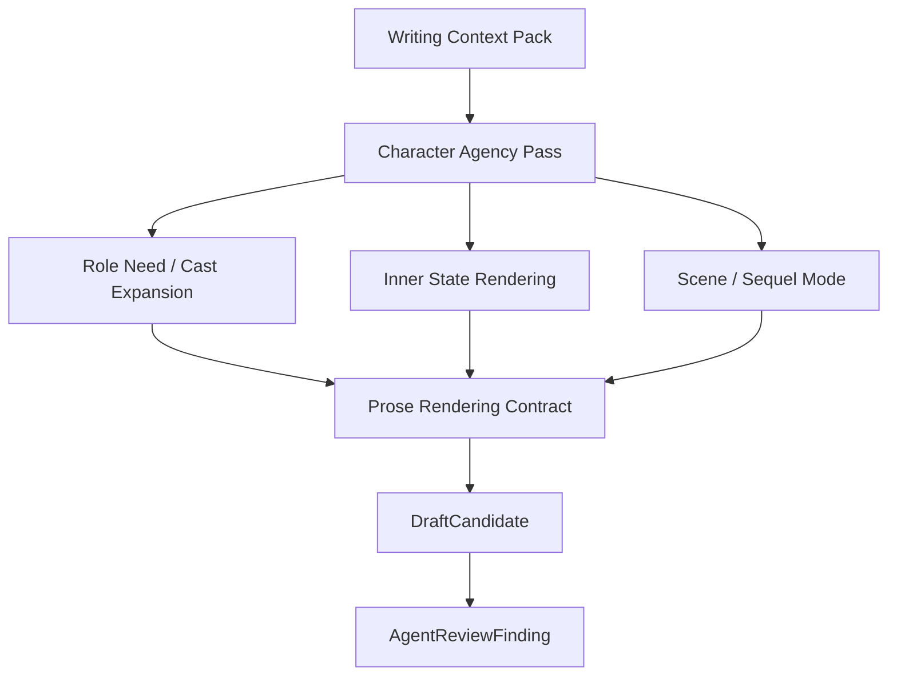

# 33. Prose Rendering Contract

> 本文档定义最终写作模型在生成正文前必须遵守的 prose contract。这里不讨论实现方式，只讨论输出约束、叙事形式和草稿层检查。

## 1. 目标

Prose Rendering Contract 是 Storytelling Control Layer 的最终输出。它把 Memory、Character Agency、Cast Expansion、Dramatization、Scene / Sequel Mode 转成一份明确的写作契约。

它解决的问题是：

```text
模型知道很多信息，但不知道应该怎样把这些信息写成故事。
```

Prose Rendering Contract 不让模型自由消化所有上下文，而是明确告诉它：

- 当前段落是什么模式；
- 当前 POV 能写什么、不能写什么；
- 哪些内心状态必须戏剧化；
- 哪些角色可以使用；
- 是否允许新角色；
- 本段必须有怎样的 turn；
- 哪些内容只能作为风险提示，不能当 canon。

## 2. 数据流



## 3. Contract 结构

| 字段 | 说明 |
|---|---|
| passage_mode | scene / sequel / mixed |
| pov_character | 当前 POV 角色 |
| pov_mode | first_person / third_limited / omniscient / multiple / unknown |
| target_position | target_source_id / target_version_id / affected_range / base_hash |
| scene_goal | 本段角色想达成什么 |
| opposition | 阻力来自哪里 |
| required_turn | 本段必须发生的小转折 |
| allowed_cast | 当前可使用角色 |
| new_character_policy | 是否允许创建新角色，以及允许级别 |
| role_slots | 当前需要的角色功能槽 |
| dramatic_behavior_plan | 内心状态如何转译为动作、对话、沉默、物体和选择 |
| inner_state_budget | 直接内心说明预算 |
| forbidden_knowledge | 不能写入正文的信息 |
| risk_context | proposed / disputed / open ReviewItem，只能作为注意事项 |
| style_constraints | 叙述距离、节奏、意象、对话密度 |
| ending_shape | setback / decision / hook / transition |
| hard_no | 明确禁止的写法 |

## 4. Contract 示例

```text
passage_mode:
  scene

pov_character:
  Mira

scene_goal:
  试探 Kestrel 是否知道地图真正去向。

opposition:
  Kestrel 想尽快离开现场，并避免提到仓库。

required_turn:
  Mira 故意说错仓库名，Kestrel 下意识纠正一个细节。

allowed_cast:
  - Mira
  - Kestrel
  - Orrin（非 POV，只能通过动作和台词表现）

new_character_policy:
  不需要新角色。

inner_state_budget:
  最多 1 句短内心说明。

forbidden_knowledge:
  Mira 不知道地图已经被转交给旧王。
  Mira 不知道 Orrin 的全部计划。

show_not_tell_targets:
  - Mira 对 Orrin 的依赖恐惧必须通过动作表现。
  - Mira 对 Kestrel 的怀疑必须通过试探和观察表现。

hard_no:
  - 不要写 Kestrel 的内心。
  - 不要直接写“Mira 开始怀疑 Kestrel”。
  - 不要让 Orrin 解释真相。
```

## 5. 硬约束与软约束

| 类型 | 说明 | 违反后果 |
|---|---|---|
| hard constraint | POV、forbidden knowledge、canon、source position | high risk AgentReviewFinding |
| medium constraint | scene goal、turn、new character policy | medium risk |
| soft constraint | style、rhythm、imagery | low / medium risk |

### Hard constraints

- 不得写非 POV 角色内心；
- 不得把 proposed / disputed 当 canon；
- 不得绕过 forbidden knowledge；
- 不得覆盖 target range 之外的文本；
- 不得创建超出 new_character_policy 允许级别的新角色；
- 不得自动解决 open ReviewItem。

### Soft constraints

- 句长和段落节奏；
- 意象偏好；
- 对话密度；
- 叙述距离；
- 当前作品的语言质感。

## 6. New Character Policy in Contract

Contract 应明确是否允许新角色。

| policy | 含义 |
|---|---|
| no_new_character | 当前段落不允许引入新人物 |
| allow_local_extra | 允许一次性场景人物 |
| allow_minor_supporting | 允许轻量小配角 |
| require_author_confirmation | 可能是长期角色，需要作者接受或确认 |

示例：

```text
new_character_policy:
  allow_local_extra

allowed_role_slots:
  - function: gatekeeper
    scope: scene_local
    max_complexity: low
```

## 7. Inner State Budget

Contract 必须给直接内心说明预算。

| passage_mode | 默认预算 |
|---|---|
| scene | 0-1 句短内心 |
| dialogue conflict | 1-2 句短内心 |
| sequel | 可多一些，但必须服务 dilemma -> decision |
| mixed | 少量，避免解释过多 |

预算不是为了机械限制句子，而是防止最终文本把 Character Agency Profile 平铺成心理说明。

## 8. Ending Shape

每段都应有收束形态。

| ending_shape | 说明 |
|---|---|
| setback | 角色目标受阻或付出代价 |
| decision | 角色做出下一步选择 |
| hook | 留下一个新问题或紧张点 |
| transition | 自然进入下一动作或场景 |
| image | 以一个具有情绪或象征作用的画面结束 |

如果段落没有任何变化或收束，应产生 `no_turn_risk`。

## 9. Risk Context 使用规则

Risk Context 里可能包含 open ReviewItem、proposed edge、disputed edge、低置信 alias。

规则：

```text
Risk Context 可以提醒 Agent 避免错误，
但不能作为已经成立的故事事实写入正文。
```

示例：

| 风险内容 | 正确用法 | 错误用法 |
|---|---|---|
| Kestrel 可能偷了地图 | 让 Mira 试探 Kestrel | 直接写 Kestrel 确实偷了地图 |
| Orrin 身份 disputed | 避免提前揭示 | 让 POV 角色直接知道真相 |
| alias proposed | 用模糊称呼 | 强行合并为真名 |

## 10. AgentReviewFinding

如果 DraftCandidate 违反 contract，应产生草稿层风险。

| risk_type | 说明 |
|---|---|
| prose_contract_violation | 违反 contract 硬约束 |
| forbidden_knowledge_leak | 泄露 forbidden knowledge |
| non_pov_mind_reading | 写了非 POV 内心 |
| no_turn_risk | 段落没有变化或转折 |
| exposition_risk | 解释过多，缺少场景动作 |
| cast_policy_violation | 创建或复用角色不符合 contract |
| target_range_risk | 试图修改 target range 之外的内容 |

这些风险默认是 AgentReviewFinding，不是正式 ReviewItem。只有作者接受文本并进入 Memory 后，Memory Conflict Policy 才能决定是否产生正式 ReviewItem。

## 11. Prose model 的输入边界

最终写作模型不应直接拿到所有 Memory 原文和所有角色内心。它应该拿到：

- 经过筛选的 Writing Context Pack；
- Character Agency Pass 的必要结论；
- Dramatic Behavior Plan；
- Prose Rendering Contract；
- 当前 text window；
- 明确 forbidden knowledge；
- 明确 hard_no。

它不应该拿到：

- 非 POV 角色完整内心；
- 大量 unrelated Memory；
- 未标注状态的 proposed / disputed facts；
- 没有转译过的心理清单；
- 可能让它自作主张的大纲式未来计划。

## 12. 结论

Prose Rendering Contract 是最终 prose 生成前的控制面。

```text
不是让模型“尽量写好”，
而是先定义当前段落的模式、边界、角色功能、戏剧行为和风险，
再让模型在这些约束内写。
```

它是防止“角色内心流水账”和“过度复用旧角色”的最后一道结构化约束。